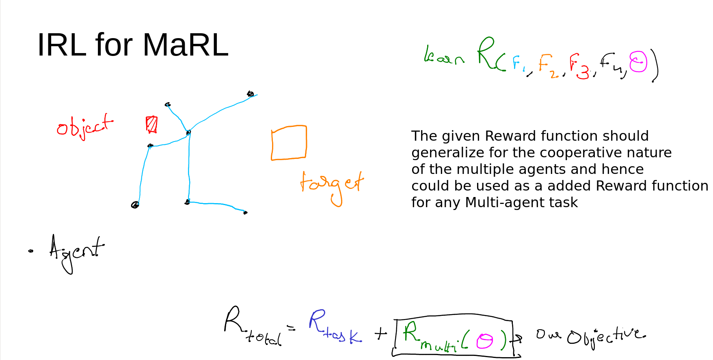
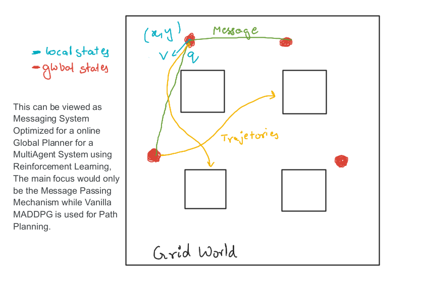

# IG-projects-Ideas

## Index
 - Unsupervised Methodology for executing a hybrid of SORT and KCF trackers for Multitracking (Idea by - Amshra267) - [Idea Doc](https://docs.google.com/document/d/1lo_nFekcI8eoOh4UFRN_DAiQVP_RyOfbHmfWBB_2vRs/edit?usp=sharing)
 - [Inverse Reinforcement Learning for Multi-Agent Setup](#inverse-reinforcement-learning-for-multi-agent-setup) (Idea by - hex-plex)
 - Analysis of Existing Loss Functions and designing our own loss function for edge preservence autoencodings. (idea by - Amshra267) - [Idea Doc](https://docs.google.com/document/d/1SNUQHhvWbjKLHchQrdXDGrDYrnLbru1bt8OPpyKHBLE/edit?usp=sharing)
 - [Message passing with Graph Attention Neural Network for MultiAgent systems](#message-passing-with-graph-attention-neural-network-for-multiagent-systems). (idea by hex-plex)
 - Generating Images containing combined information from multiple Images by exploitation of a particular feature. (Idea by - lavish619) - [Idea Doc](https://docs.google.com/document/d/1fEpyInntouBOSOyHptKcjxN4uJRRYyGv_U3clHG-9EQ/edit?usp=sharing) 
- One of the tasks from SemEval2022. Read this [doc](https://archraven.notion.site/SemEval-2022-528700776c28407e97eba547256edba9) for more details. (Contact- @arch-raven) 

## Projects

### Inverse Reinforcement Learning for Multi-Agent Setup

**Objective** 
*The main idea of the problem statement is to design a Reward for chaotic system such as a MultiAgent Comparative setup, Where individual agent may not contribute to a final reward and will not promote many trivial behaviors which we come to expect. The main objective of the project is to formulate a IRL algorithm which seemless workes across variables like number of agents, role of each agent and horizon of the problem. The emphasize will not be on the Complexity of the algorithm but rather on the Concept of Distributed MultiAgent Reward Learning*

**Setup** 
A simple ant hill is the simplest of multiagent system with surplus amount of Teacher Data readily available for us to use. A simple 2D enviroment can be used for testing out the algorithm and simple location trackers can be deployed on the available video data to get the neccesary data. The main problem to address would be to representating the observation of the data for IRL.

### Message passing with Graph Attention Neural Network for MultiAgent systems

**Preliminary Reading** 
Message Passing in Multi Agent systems: [Learning Multiagent Communicationwith Backpropagation](https://proceedings.neurips.cc/paper/2016/file/55b1927fdafef39c48e5b73b5d61ea60-Paper.pdf)

Graph Neural Network with Self Attention: [Multi-Agent Game Abstraction via Graph Attention Neural Network](https://ojs.aaai.org/index.php/AAAI/article/view/6211/6067)

**Objective** 
*Given very large and Cluttered Environment with multiple agents and limited Sensory Input to Individual Agent, The most crucial information is the message passed among local group of agents. These are local relations can be either estimated using some physical parameters, But a better approach is to use Graph Neural Networks and use Node level classification followed by message passing while maintaining heirarchy. These messages passed in a real world dynamic system needs to be more specific to Peer2Peer hence we are apply self attention before massing the context message. This in total should achieve high cooperation with high degree of stochasticity for a real world system*

**Setup** 
A simple grid world system with multiple agents to drop off packages at multiple individual destinations. The main use of the policy is to test it out against a custom grid world to the same, and also against the classical 4 junction. The policy would be given very few inputs like the local states and positon of self by which it would have to achieve collision free delivery of multiple packages with the highest effiecieny. 

**Note :** People opting for this project contact soon, as we would be taking you in for the FlipKart Grid challenge Team representing our Institute.
